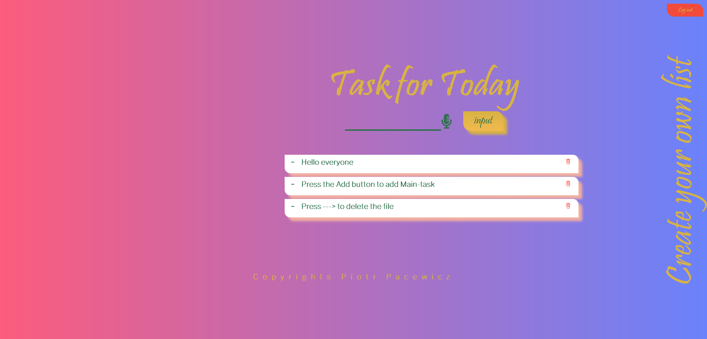
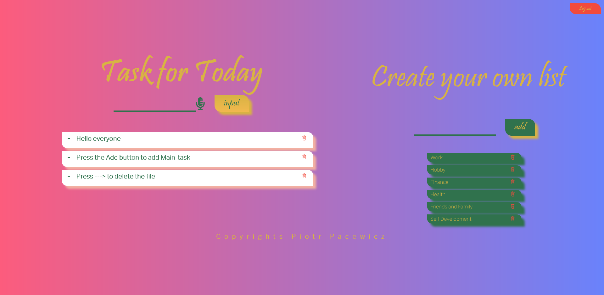
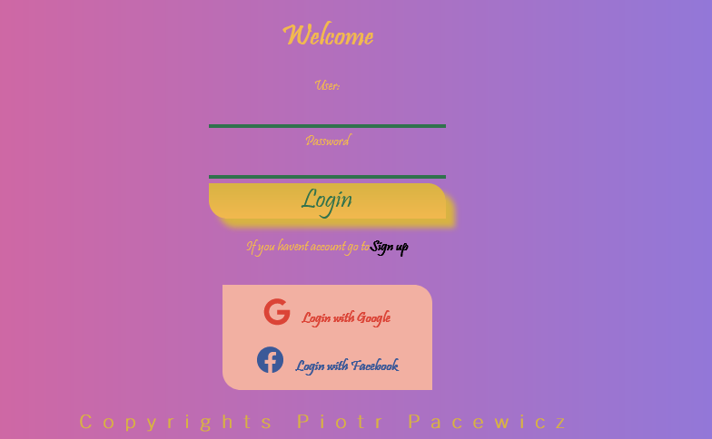

# Hexagon Task Manager

> Application to help you keep balance in your life.

[![NPM Version][npm-image]][npm-url]

One to two paragraph statement about your product and what it does.
Hidden Categories list

Categories list

Login


## Installation

OS X & Linux & Windows:

```sh
npm install
```

create .env file and put variables:

Create mongodb account for variable DB_USER and DB_PASS:
https://www.mongodb.com/
or
install mongodb local and use DB_HOST

All instruction how to create authorization is on :
https://www.passportjs.org/packages/

Create Authorization Google for variable CLIENT_ID CLIENT_SECRET :
https://console.cloud.google.com/apis

Create Authorization Facebook for variable FB_CLIENT_ID FB_CLIENT_SECRET :
https://developers.facebook.com/

```sh
create .env
```

```sh
edit .env and put variables:
DB_HOST=
DB_USER=
DB_PASS=
CLIENT_ID=
CLIENT_SECRET=
FB_CLIENT_ID=
FB_CLIENT_SECRET=
example:
DB_HOST=localhost
DB_USER=admin
DB_PASS=password
```

## Usage example

-Create User on :
/register
-Login User on :
/login

- User can create/delete task task and categories by tapping or saying. App register voice when user clicks microphone next to input. When app register wrong user can click again on microphone. User need to click input/add button to add task to the tasks/list.

-On desktop Category is hidden in the right corner. To open categories User need to click on create your own list headline.

<!-- ## Development setup

Describe how to install all development dependencies and how to run an automated test-suite of some kind. Potentially do this for multiple platforms.

```sh
make install
npm test
``` -->

## Release History

- 2.0.0
  - Create Users and create uniques task under selected user.
- 1.5.0
  - make animation to hide categories list and save styles classes to localStorage
- 1.4.0
  - add styles and design to aplication
- 1.3.0
  - Do connection to MongoDB
- 1.2.2
  - create animation to tasks
- 1.2.0
  - Create categories to Task Manager
- 1.1.0
  - The first proper release
  - Create To Do Task in main route
- 1.0.0
  - initializate project

## Author

Piotr Pacewicz

- Website: https://ersati.github.io/portfolio/index.html
- Frontend Mentor:
- Twitter: @mrtrifler
- Github: https://github.com/ersati
- LinkedIn: https://www.linkedin.com/in/piotr-pacewicz-59544516b/

[https://github.com/ersati/my-to-do-app](https://github.com/ersati/)

## Contributing

1. Fork it (<https://github.com/ersati/my-to-do-app/fork>)
2. Create your feature branch (`git checkout -b feature/fooBar`)
3. Commit your changes (`git commit -am 'Add some fooBar'`)
4. Push to the branch (`git push origin feature/fooBar`)
5. Create a new Pull Request

<!-- Markdown link & img dfn's -->
<!--
[npm-image]: https://img.shields.io/npm/v/datadog-metrics.svg?style=flat-square
[npm-url]: https://npmjs.org/package/datadog-metrics
[npm-downloads]: https://img.shields.io/npm/dm/datadog-metrics.svg?style=flat-square
[travis-image]: https://img.shields.io/travis/dbader/node-datadog-metrics/master.svg?style=flat-square
[travis-url]: https://travis-ci.org/dbader/node-datadog-metrics
[wiki]: https://github.com/yourname/yourproject/wiki -->
